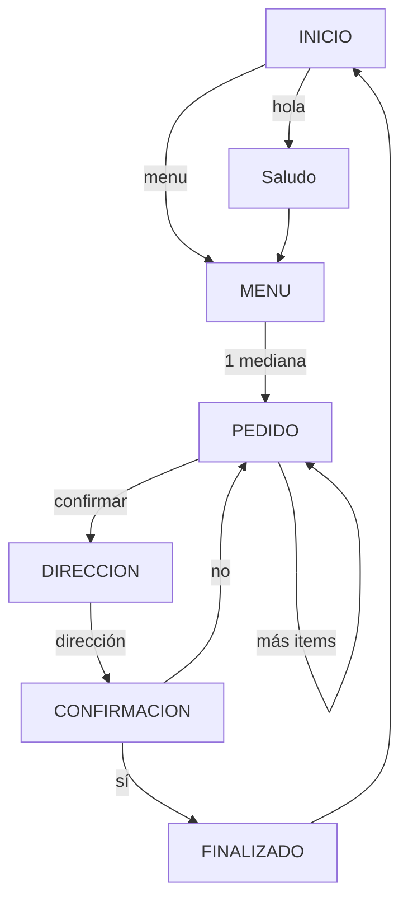

# 🔄 Flujo de Trabajo - Pizza Bot WhatsApp

## 📋 Resumen del Sistema

El **Pizza Bot** es una aplicación FastAPI que automatiza la toma de pedidos de pizza a través de WhatsApp. El sistema está diseñado con una arquitectura modular que separa claramente las responsabilidades entre modelos, servicios y rutas.

## 🏗️ Arquitectura General

```
📱 WhatsApp (Cliente) 
    ↓ Webhook
🌐 FastAPI (API Gateway)
    ↓ Routers
🧠 Services (Lógica de negocio)
    ↓ Models
🗄️ PostgreSQL (Base de datos)
```

---

## 📁 Estructura de Archivos `/app`

### 1. **Models** - Modelos de Datos (`/app/models/`)

#### **`cliente.py`**
- **Propósito**: Define la estructura de datos para los clientes de WhatsApp
- **Tabla**: `clientes`
- **Campos principales**:
  - `numero_whatsapp`: Identificador único del cliente
  - `nombre`: Nombre del cliente (opcional)
  - `direccion`: Dirección por defecto
  - `fecha_registro`: Timestamp de registro
  - `ultimo_pedido`: Fecha del último pedido

#### **`pizza.py`**
- **Propósito**: Define el catálogo de pizzas disponibles
- **Tabla**: `pizzas`
- **Campos principales**:
  - `nombre`: Nombre de la pizza
  - `descripcion`: Descripción detallada
  - `precio_pequena/mediana/grande`: Precios por tamaño
  - `disponible`: Estado de disponibilidad
  - `emoji`: Emoji para mostrar en el chat

#### **`pedido.py`**
- **Propósito**: Gestiona los pedidos y sus detalles
- **Tablas**: `pedidos` y `detalle_pedidos`
- **Funcionalidad**:
  - `Pedido`: Información general del pedido
  - `DetallePedido`: Items específicos de cada pedido
  - **Estados**: pendiente → confirmado → preparando → enviado → entregado

---

### 2. **Services** - Lógica de Negocio (`/app/services/`)

#### **`whatsapp_service.py`**
```python
class WhatsAppService:
    # Funciones principales:
    - send_message()           # Enviar mensajes por WhatsApp
    - validate_webhook()       # Validar autenticidad de Twilio
    - _format_phone_number()   # Formatear números de teléfono
```

**Responsabilidades**:
- 📤 Envío de mensajes a través de Twilio
- 🔒 Validación de webhooks de seguridad
- 📞 Formateo correcto de números de teléfono
- 🚫 Manejo de errores de Twilio

#### **`bot_service.py`**
```python
class BotService:
    # Funciones principales:
    - process_message()           # Procesador principal de mensajes
    - handle_saludo()            # Maneja saludos iniciales
    - handle_menu()              # Muestra menú de pizzas
    - handle_seleccion_pizza()   # Procesa selección de pizzas
    - handle_direccion()         # Captura dirección de entrega
    - handle_confirmacion()      # Confirma pedido final
```

**Estados de Conversación**:
- `INICIO`: Usuario nuevo o saludo
- `MENU`: Mostrando opciones de pizzas
- `PEDIDO`: Construyendo carrito de compras
- `DIRECCION`: Solicitando dirección de entrega
- `CONFIRMACION`: Confirmando pedido final
- `FINALIZADO`: Pedido completado

**Responsabilidades**:
- 🧠 Lógica principal del chatbot
- 💬 Manejo de estados de conversación
- 🛒 Gestión del carrito de compras
- 📝 Procesamiento de comandos del usuario

#### **`pedido_service.py`**
```python
class PedidoService:
    # Funciones principales:
    - crear_pedido()              # Crear pedido en BD
    - obtener_pedido()            # Obtener pedido por ID
    - obtener_pedidos_cliente()   # Historial del cliente
    - actualizar_estado_pedido()  # Cambiar estado
    - calcular_total_carrito()    # Calcular totales
```

**Responsabilidades**:
- 💾 Operaciones CRUD de pedidos
- 🧮 Cálculos financieros (totales, subtotales)
- 📊 Consultas de historial
- 🔄 Gestión de estados de pedidos

---

### 3. **Routers** - Endpoints de API (`/app/routers/`)

#### **`webhook.py`**
```python
# Endpoints principales:
- POST /webhook/whatsapp      # Recibe mensajes de WhatsApp
- GET /webhook/test           # Endpoint de prueba
- POST /webhook/send-message  # Envío manual de mensajes
```

**Flujo de Webhook**:
1. ✅ **Validación**: Verificar firma de Twilio
2. 🔍 **Extracción**: Obtener número y mensaje
3. 🧠 **Procesamiento**: Llamar a `BotService`
4. 📤 **Respuesta**: Enviar respuesta via `WhatsAppService`
5. 📝 **Logging**: Registrar actividad

#### **`pizzas.py`**
```python
# Endpoints principales:
- GET /pizzas/               # Todas las pizzas
- GET /pizzas/{id}          # Pizza específica
- GET /pizzas/menu/text     # Menú formato WhatsApp
```

**Responsabilidades**:
- 📋 API para consultar catálogo
- 📱 Formato especial para WhatsApp
- ✅ Filtros de disponibilidad

#### **`pedidos.py`**
```python
# Endpoints principales:
- GET /pedidos/                    # Todos los pedidos
- GET /pedidos/{id}               # Pedido específico
- PUT /pedidos/{id}/estado        # Actualizar estado
- GET /pedidos/cliente/{whatsapp} # Pedidos por cliente
```

**Responsabilidades**:
- 📊 API administrativa de pedidos
- 🔄 Gestión de estados
- 👤 Consultas por cliente

---

### 4. **Utils** - Utilidades (`/app/utils/`)

#### **`logging_config.py`**
- **Propósito**: Configuración centralizada de logging
- **Funcionalidad**: 
  - Formato estructurado de logs
  - Integración con Sentry (producción)
  - LoggerMixin para clases

---

## 🔄 Flujo Completo de un Pedido

### **1. Recepción del Mensaje (Webhook)**
```
WhatsApp → Twilio → webhook.py
```
- Usuario envía mensaje por WhatsApp
- Twilio recibe y envía webhook a `/webhook/whatsapp`
- `process_whatsapp_message()` valida y extrae datos

### **2. Procesamiento del Bot (Bot Service)**
```
webhook.py → bot_service.py
```
- `BotService.process_message()` analiza el mensaje
- Determina estado actual de la conversación
- Ejecuta la función correspondiente al estado

### **3. Operaciones de Base de Datos (Services)**
```
bot_service.py → pedido_service.py → models
```
- Si es necesario, consulta/actualiza base de datos
- `PedidoService` maneja operaciones de pedidos
- Modelos de SQLAlchemy interactúan con PostgreSQL

### **4. Generación de Respuesta (Bot Service)**
```
bot_service.py → respuesta generada
```
- Bot genera respuesta apropiada
- Actualiza estado de conversación
- Retorna mensaje para enviar

### **5. Envío de Respuesta (WhatsApp Service)**
```
webhook.py → whatsapp_service.py → Twilio → WhatsApp
```
- `WhatsAppService.send_message()` envía respuesta
- Twilio entrega mensaje al usuario
- Sistema registra logs de la transacción

---

## 📊 Estados y Transiciones



---

## 🔧 Comandos y Respuestas del Bot

### **Comandos Especiales**
- `hola`, `hello`, `buenas` → Saludo inicial
- `menu`, `menú`, `carta` → Mostrar catálogo
- `pedido`, `mis pedidos` → Estado de pedidos
- `ayuda`, `help` → Información de ayuda

### **Selección de Pizzas**
- Formato: `{numero} {tamaño}` (ej: "1 mediana")
- Tamaños: pequeña, mediana, grande
- Agregar al carrito automáticamente

### **Gestión del Carrito**
- `agregar` → Continuar agregando items
- `confirmar` → Proceder a dirección
- `cancelar` → Cancelar pedido actual

---

## ⚡ Características Técnicas

### **Rate Limiting**
- Webhook WhatsApp: 30 requests/minuto
- Protección contra spam

### **Validación de Seguridad**
- Verificación de firma de Twilio
- Validación en producción (DEBUG=False)

### **Manejo de Errores**
- Excepciones de Twilio capturadas
- Mensajes de error amigables al usuario
- Logging detallado para debugging

### **Base de Datos**
- SQLAlchemy ORM para modelos
- Migraciones con Alembic
- Relaciones entre tablas establecidas

---

## 🔍 Puntos de Entrada del Sistema

1. **`/webhook/whatsapp`** - Principal (mensajes de usuarios)
2. **`/pizzas/`** - Consulta de catálogo
3. **`/pedidos/`** - Gestión administrativa
4. **`/docs`** - Documentación automática de FastAPI

---

## 🚀 Inicialización del Sistema

El sistema se inicializa en `main.py`:
1. Configuración de FastAPI
2. Conexión a base de datos
3. Registro de routers
4. Configuración de CORS y middleware
5. Inicio del servidor uvicorn

Este flujo permite un manejo completo del ciclo de vida de un pedido de pizza, desde la recepción del mensaje inicial hasta la confirmación final del pedido, todo a través de una conversación natural por WhatsApp.
